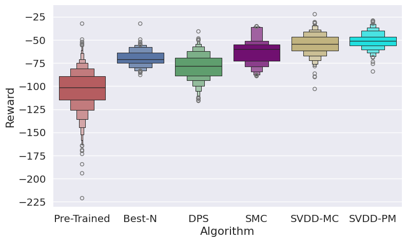

# Derivative-Free Guidance in Diffusion Models with Soft Value-Based Decoding (Images)

This code accompanies the paper on soft value-based decoding in diffusion models, where the objective is to maximize downstream reward functions in diffusion models. In this implementation, we focus on generating **images** with high scores. For **biological sequences**, refer to [here](https://github.com/masa-ue/SVDD). 

Nottably, our algorithm is **derivative-free, training-free, and fine-tuning-free**. 


### Compressibility 

We use Stable Diffusion v1.5 as the pre-trained model. We optimize compressibility.  

Run the following: 

```
CUDA_VISIBLE_DEVICES=0 python inference_decoding_all.py --reward 'compressibility' --bs 3 --num_images 3 --duplicate_size 20 
```

Here is the result. 



### Aesthetic score  

We use Stable Diffusion v1.5 as the pre-trained model. We optimize aesthetic predictors.  

Run the following 

```
CUDA_VISIBLE_DEVICES=0 python inference_decoding_all.py --reward 'aesthetic' --bs 3 --num_images 3 --duplicate_size 20 
```
Here is the result. 


### Acknowledgement 

Our codebase is directly built on top of [RCGDM](https://github.com/Kaffaljidhmah2/RCGDM)  


### Installation

Create a conda environment with the following command:
```
conda create -n SVDD_images python=3.10
conda activate SVDD_images
conda install pytorch torchvision pytorch-cuda=12.1 -c pytorch -c nvidia
pip install -r requirements.txt
```

### References 

If you find this work useful in your research, please cite:

```
@article{li2024derivative,
  title={Derivative-Free Guidance in Continuous and Discrete Diffusion Models with Soft Value-Based Decoding},
  author={Li, Xiner and Zhao, Yulai and Wang, Chenyu and Scalia, Gabriele and Eraslan, Gokcen and Nair, Surag and Biancalani, Tommaso and Regev, Aviv and Levine, Sergey and Uehara, Masatoshi},
  journal={arXiv preprint arXiv:2408.08252},
  year={2024}
}
```